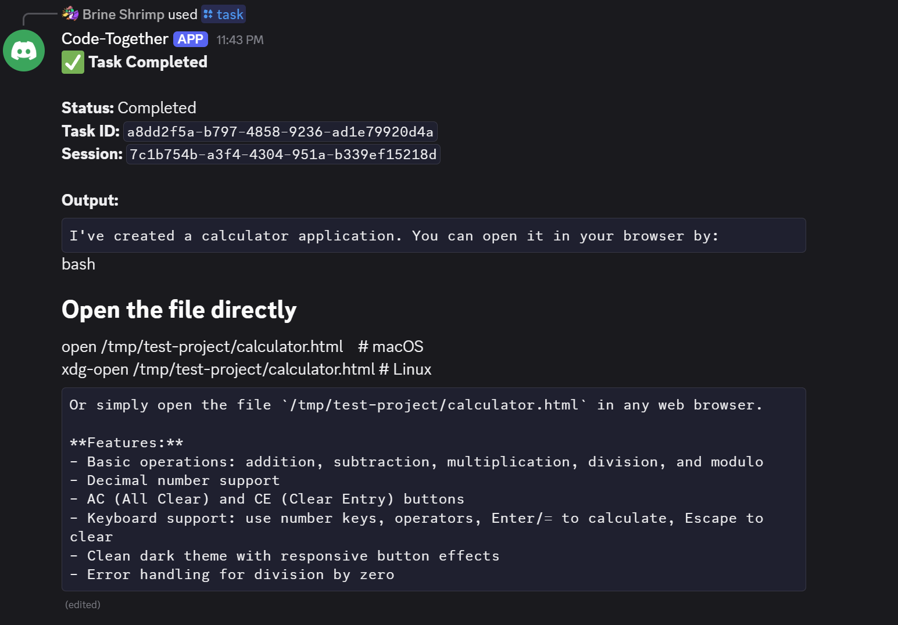

# Claude Code Discord Bot

A Discord bot for orchestrating Claude Code instances, supporting both local execution and distributed cluster deployments.



## Architecture Overview

```
┌─────────────────────────────────────────────────────────────────────────┐
│                         Discord Server                                   │
│                                                                          │
│  /task prompt:"Fix the bug"    /share add user:@teammate                │
│  /project add name:myapp       /register local url:http://...           │
└─────────────────────────────────┬───────────────────────────────────────┘
                                  │
                                  ▼
┌─────────────────────────────────────────────────────────────────────────┐
│                      Discord Bot (Rust/Serenity)                         │
│                                                                          │
│  • Extracts user identity from Discord (server-side, secure)            │
│  • Routes commands to appropriate wrapper                                │
│  • Manages slash commands: /task, /project, /share, /register           │
└─────────────────────────────────┬───────────────────────────────────────┘
                                  │
                    ┌─────────────┴─────────────┐
                    ▼                           ▼
┌───────────────────────────────┐  ┌───────────────────────────────────────┐
│   Local Mode                  │  │   Orchestrator Mode                    │
│   (User's Machine)            │  │   (Central Server)                     │
│                               │  │                                        │
│   SERVICE_MODE=local          │  │   SERVICE_MODE=orchestrator            │
│                               │  │                                        │
│   • Executes Claude Code      │  │   • Routes to user wrappers            │
│   • User's own files          │  │   • User registry                      │
│   • No isolation needed       │  │   • Sharing permissions                │
└───────────────────────────────┘  └───────────────────────────────────────┘
```

## Table of Contents

- [How the Discord Bot Works](#how-the-discord-bot-works)
- [Quick Start](#quick-start)
- [Local Testing](#local-testing)
- [Deployment Models](#deployment-models)
  - [Model 1: Local Wrapper (Single User)](#model-1-local-wrapper-single-user)
  - [Model 2: Multi-User with Sharing](#model-2-multi-user-with-sharing)
  - [Model 3: Containerized Workers (Isolated)](#model-3-containerized-workers-isolated)
- [Discord Commands](#discord-commands)
- [Security Model](#security-model)
- [Configuration Reference](#configuration-reference)
- [Development Setup](#development-setup)

---

## How the Discord Bot Works

Understanding the connection flow helps with debugging and deployment decisions.

### Connection Architecture

```
┌─────────────────┐                         ┌─────────────────┐
│                 │     WebSocket           │                 │
│  Your Server    │◄───────────────────────►│  Discord API    │
│  (cargo run)    │   Outbound connection   │  Gateway        │
│                 │   Persistent keepalive  │                 │
└────────┬────────┘                         └─────────────────┘
         │
         │ HTTP (localhost)
         ▼
┌─────────────────┐
│  Wrapper        │
│  (claude-wrapper)│
└────────┬────────┘
         │
         │ Subprocess
         ▼
┌─────────────────┐
│  Claude Code    │
│  CLI            │
└─────────────────┘
```

### Step-by-Step Flow

1. **Bot starts** (`cargo run`)
   - Loads `DISCORD_TOKEN` from environment
   - Creates Serenity client with WebSocket connection to Discord Gateway

2. **Connection established**
   - Bot makes an **outbound** WebSocket connection to Discord
   - Discord authenticates using your bot token
   - Connection stays alive with periodic heartbeats

3. **Command registration**
   - On `Ready` event, bot registers slash commands with Discord
   - Commands appear in your Discord server

4. **User runs a command** (e.g., `/task prompt:"Fix the bug"`)
   - Discord pushes an `Interaction` event through the WebSocket
   - Bot receives event, extracts user ID (server-side, secure)
   - Bot calls wrapper via HTTP: `POST /tasks`
   - Wrapper invokes Claude Code CLI
   - Response flows back: CLI → Wrapper → Bot → Discord → User

### Key Points

| Aspect | Detail |
|--------|--------|
| **No port forwarding needed** | Bot makes outbound connection to Discord |
| **Works behind firewalls** | Only outbound HTTPS/WSS on port 443 |
| **User identity is secure** | Discord provides verified user ID server-side |
| **Wrapper is local** | Bot connects to wrapper via localhost or LAN |

### Why This Matters

- **Deployment flexibility**: Run the bot anywhere with internet access
- **Security**: No exposed ports means smaller attack surface
- **Reliability**: Discord handles connection management and delivery

---

## Quick Start

### Prerequisites

- Python 3.11+
- Rust 1.70+
- Claude Code CLI (`npm install -g @anthropic-ai/claude-code`)
  - **Windows users:** Requires WSL (Windows Subsystem for Linux)
- Discord Bot Token ([Discord Developer Portal](https://discord.com/developers/applications))

### 1. Authenticate Claude Code CLI

The wrapper uses your **local Claude Code CLI authentication** - no API key needed in the environment.

> **Windows Users:** Claude Code CLI requires WSL. Run these commands in a WSL terminal (e.g., Ubuntu), not PowerShell.

```bash
# Install Claude Code CLI (in WSL on Windows)
npm install -g @anthropic-ai/claude-code

# Authenticate (one-time setup)
claude login
```

This stores credentials locally. The wrapper invokes the CLI, which uses these stored credentials.

### 2. Clone and Configure

```bash
git clone <repository>
cd discord-bot

# Copy environment template
cp .env.example .env

# Edit with your values
nano .env
```

Required environment variables:
```env
DISCORD_TOKEN=your_bot_token
DISCORD_GUILD_ID=your_server_id
# Note: ANTHROPIC_API_KEY is NOT required - Claude Code CLI uses its own auth
```

### 3. Install and Start the Wrapper

```bash
cd wrapper
pip install -e .

# Run the wrapper (default: http://localhost:8000)
claude-wrapper
```

The wrapper will start and display:
```
INFO:     Started server process
INFO:     Waiting for application startup.
INFO:     Starting Claude Code wrapper service...
INFO:     Application startup complete.
INFO:     Uvicorn running on http://0.0.0.0:8000
```

### 4. Start the Discord Bot

In a new terminal:
```bash
cd bot
cargo run
```

### 5. Use in Discord

```
/project add name:myapp path:/path/to/project
/task prompt:"List all files in the project" project:myapp
```

---

## Command Reference

### Wrapper Commands

```bash
# Install the wrapper
cd wrapper
pip install -e .

# Run with defaults (localhost:8000)
claude-wrapper

# Or run with Python module syntax
python -m wrapper.main

# Or run with custom host/port via environment
WRAPPER_HOST=0.0.0.0 WRAPPER_PORT=9000 claude-wrapper
```

### Bot Commands

```bash
# Development
cd bot
cargo run

# Release build
cargo build --release
./target/release/claude-bot
```

---

## Local Testing

Follow these steps to test the complete system locally before deployment.

### Prerequisites Checklist

- [ ] Python 3.11+ installed
- [ ] Rust 1.70+ installed
- [ ] Node.js/npm installed (for Claude Code CLI)
- [ ] Discord bot created at [Discord Developer Portal](https://discord.com/developers/applications)
- [ ] Bot invited to your test server

### Platform Support

<details>
<summary><strong>Windows (Requires WSL)</strong></summary>

**Important:** Claude Code CLI requires WSL (Windows Subsystem for Linux). The bot runs on Windows, but the wrapper must run in WSL.

**1. Install WSL (if not already installed):**
```powershell
# In PowerShell as Administrator
wsl --install
# Restart your computer, then set up your Linux username/password
```

**2. Set up Claude CLI in WSL:**
```bash
# In WSL terminal (e.g., Ubuntu)
# Install Node.js if needed
curl -fsSL https://deb.nodesource.com/setup_20.x | sudo -E bash -
sudo apt-get install -y nodejs

# Install Claude Code CLI
npm install -g @anthropic-ai/claude-code
claude login

# Set up permissions
mkdir -p ~/.claude
cat > ~/.claude/settings.json << 'EOF'
{
  "permissions": {
    "allow": ["WebFetch", "WebSearch", "Read", "Write", "Edit", "Bash", "Computer"],
    "deny": []
  }
}
EOF
```

**3. Set up the Wrapper in WSL:**
```bash
# In WSL terminal
cd /mnt/c/path/to/CodeTogether/wrapper  # Adjust to your Windows path
python3 -m venv .venv
source .venv/bin/activate
pip install -e .
```

**4. Run the services:**
```powershell
# Terminal 1 (PowerShell) - Bot runs on Windows
cd bot
cargo run

# Terminal 2 (PowerShell) - Wrapper runs in WSL
wsl -e bash -c "cd /mnt/c/path/to/CodeTogether/wrapper && source .venv/bin/activate && claude-wrapper"
```

**Tip:** Windows paths like `C:\Projects\CodeTogether` become `/mnt/c/Projects/CodeTogether` in WSL.

</details>

<details>
<summary><strong>Linux / macOS</strong></summary>

**1. Install Claude Code CLI:**
```bash
# Install Node.js if needed (Ubuntu/Debian)
curl -fsSL https://deb.nodesource.com/setup_20.x | sudo -E bash -
sudo apt-get install -y nodejs

# macOS with Homebrew
brew install node

# Install Claude CLI
npm install -g @anthropic-ai/claude-code
claude login

# Set up permissions
mkdir -p ~/.claude
cp .claude/settings.json ~/.claude/
```

**2. Run the services:**
```bash
# Terminal 1 - Wrapper
cd wrapper
python3 -m venv .venv
source .venv/bin/activate
pip install -e .
claude-wrapper

# Terminal 2 - Bot
cd bot
cargo run
```

</details>

### Step 1: Create Discord Bot

1. Go to [Discord Developer Portal](https://discord.com/developers/applications)
2. Click "New Application" → name it → Create
3. Go to "Bot" tab → "Reset Token" → copy the token
4. Under "Privileged Gateway Intents", enable what you need (none required for slash commands)
5. Go to "OAuth2" → "URL Generator"
   - Scopes: `bot`, `applications.commands`
   - Bot Permissions: `Send Messages`, `Use Slash Commands`
6. Copy the generated URL → open in browser → add bot to your test server

### Step 2: Get Guild ID

1. In Discord, enable Developer Mode: User Settings → App Settings → Advanced → Developer Mode
2. Right-click your server name → "Copy Server ID"
3. This is your `DISCORD_GUILD_ID` (enables instant command registration for testing)

### Step 3: Configure Environment

```bash
# In project root
cp .env.example .env
```

Edit `.env`:
```env
DISCORD_TOKEN=your_bot_token_here
DISCORD_GUILD_ID=your_server_id_here
WRAPPER_URL=http://localhost:8000
```

### Step 4: Authenticate Claude Code CLI

> **Windows Users:** Run these commands in WSL, not PowerShell.

```bash
# Install Claude Code CLI (in WSL on Windows, or native terminal on Linux/macOS)
npm install -g @anthropic-ai/claude-code

# Login (opens browser for authentication)
claude login

# Verify it works
claude --version
```

### Step 5: Configure Claude Code Permissions

The wrapper needs permission to use Claude Code tools. The project includes a `.claude/settings.json` that grants necessary permissions. If running Claude outside this project, you can either:

**Option A:** Copy the settings to your home directory:
```bash
# Linux/macOS/WSL
mkdir -p ~/.claude
cp .claude/settings.json ~/.claude/

# Or create manually with these permissions:
cat > ~/.claude/settings.json << 'EOF'
{
  "permissions": {
    "allow": ["WebFetch", "WebSearch", "Read", "Write", "Edit", "Bash", "Computer"],
    "deny": []
  }
}
EOF
```

**Option B:** For quick testing, you can run Claude with `--dangerously-skip-permissions` flag, but this is not recommended for production.

### Step 6: Start the Wrapper

```bash
# Terminal 1
cd wrapper
pip install -e .
claude-wrapper
```

Expected output:
```
INFO:     Started server process [12345]
INFO:     Waiting for application startup.
INFO:     Starting Claude Code wrapper service...
INFO:     Application startup complete.
INFO:     Uvicorn running on http://0.0.0.0:8000
```

### Step 7: Start the Bot

```bash
# Terminal 2
cd bot
cargo run
```

Expected output:
```
INFO discord_bot: Starting Discord bot...
INFO discord_bot: Wrapper URL: http://localhost:8000
INFO discord_bot: Wrapper service healthy: v0.1.0
INFO discord_bot: Connecting to Discord...
INFO discord_bot: Bot connected as YourBotName
```

### Step 8: Test in Discord

```
# Register a test project
/project add name:test path:/tmp/test-project

# Create the test directory
mkdir -p /tmp/test-project

# Run a simple task
/task prompt:"Create a hello.py file that prints Hello World" project:test

# Check task status (use the task_id from the response)
/status task_id:abc123
```

### Troubleshooting

| Problem | Solution |
|---------|----------|
| "Wrapper service not available" | Ensure wrapper is running on port 8000 |
| Commands don't appear in Discord | Check `DISCORD_GUILD_ID` is set correctly |
| "claude: command not found" | Run `npm install -g @anthropic-ai/claude-code` |
| "Not authenticated" | Run `claude login` |
| Bot connects but commands fail | Check wrapper logs for errors |

### Testing the API Directly

You can test the wrapper API without Discord:

```bash
# Health check
curl http://localhost:8000/health

# Create a task (replace USER_ID with any test ID)
curl -X POST http://localhost:8000/tasks \
  -H "Content-Type: application/json" \
  -d '{
    "prompt": "What is 2+2?",
    "discord_user_id": "123456789"
  }'

# Get task status
curl http://localhost:8000/tasks/{task_id}?user_id=123456789
```

---

## Deployment Models

### Model 1: Local Wrapper (Single User)

**Best for:** Individual developers running Claude Code on their own machine.

```
┌──────────────┐     ┌─────────────────┐     ┌──────────────┐
│   Discord    │────▶│   Discord Bot   │────▶│   Wrapper    │
│   Server     │     │   (anywhere)    │     │   (local)    │
└──────────────┘     └─────────────────┘     └──────┬───────┘
                                                    │
                                             Claude Code CLI
                                                    │
                                             Your local files
```

**Setup:**

```env
# wrapper/.env
SERVICE_MODE=local
ALLOWED_PROJECT_DIRS=           # Empty = no restrictions
```

```bash
# Start wrapper on your machine
cd wrapper && python -m wrapper.main

# Register in Discord
/register local url:http://your-ip:8000
```

**Security:** You're running on your own machine with your own permissions. No isolation needed.

---

### Model 2: Multi-User with Sharing

**Best for:** Teams collaborating on shared projects with trusted members.

```
┌──────────────────────────────────────────────────────────────────────┐
│                          Discord Server                               │
│                                                                       │
│   User A: /share add user:@UserB                                     │
│   User B: /task prompt:"..." target:@UserA                           │
└───────────────────────────────┬──────────────────────────────────────┘
                                │
                                ▼
┌───────────────────────────────────────────────────────────────────────┐
│                    Central Orchestrator                                │
│                    SERVICE_MODE=orchestrator                           │
│                                                                        │
│   User Registry:                                                       │
│   ┌─────────────────────────────────────────────────────────────┐    │
│   │ User A: wrapper_url=http://192.168.1.10:8000                │    │
│   │         shared_with=[User B]                                 │    │
│   │ User B: wrapper_url=http://192.168.1.20:8000                │    │
│   └─────────────────────────────────────────────────────────────┘    │
└───────────────────────────────┬──────────────────────────────────────┘
                                │
              ┌─────────────────┴─────────────────┐
              ▼                                   ▼
┌─────────────────────────┐         ┌─────────────────────────┐
│   User A's Wrapper      │         │   User B's Wrapper      │
│   (User A's machine)    │         │   (User B's machine)    │
│                         │         │                         │
│   Claude Code CLI       │         │   Claude Code CLI       │
│   User A's files        │         │   User B's files        │
└─────────────────────────┘         └─────────────────────────┘
```

**Setup:**

1. **Deploy Central Orchestrator** (on a server):
```env
# orchestrator/.env
SERVICE_MODE=orchestrator
```

```bash
python -m wrapper.main
```

2. **Each User Runs Local Wrapper**:
```env
# On each user's machine
SERVICE_MODE=local
ALLOWED_PROJECT_DIRS=/home/user/projects
```

3. **Users Register Their Wrappers**:
```
/register local url:http://my-public-ip:8000
```

4. **Share for Collaboration**:
```
# User A grants access to User B
/share add user:@UserB

# User B can now use User A's wrapper
/task prompt:"Review the code" target:@UserA
```

**Security Model:**

| Action | Allowed | Reason |
|--------|---------|--------|
| User accesses own wrapper | Yes | Always allowed |
| User accesses shared wrapper | Yes | Explicit permission granted |
| User accesses unshared wrapper | No | Permission denied |
| Spoofing Discord identity | No | Server-side verification |

**Trust Implications:**

When you share your wrapper with someone, you're giving them the ability to run Claude Code on your machine. Only share with trusted teammates.

---

### Model 3: Containerized Workers (Isolated)

**Best for:** Multi-tenant deployments, untrusted users, or production environments requiring isolation.

```
┌──────────────────────────────────────────────────────────────────────┐
│                          Discord Server                               │
└───────────────────────────────┬──────────────────────────────────────┘
                                │
                                ▼
┌───────────────────────────────────────────────────────────────────────┐
│                    Central Orchestrator                                │
│                    SERVICE_MODE=orchestrator                           │
└───────────────────────────────┬──────────────────────────────────────┘
                                │
                    ┌───────────┴───────────┐
                    ▼                       ▼
┌─────────────────────────────┐ ┌─────────────────────────────┐
│   Docker Container          │ │   Docker Container          │
│   (User A's workspace)      │ │   (User B's workspace)      │
│                             │ │                             │
│   Volume: /data/users/A     │ │   Volume: /data/users/B     │
│   Read-only: true           │ │   Read-only: true           │
│   No network (optional)     │ │   No network (optional)     │
└─────────────────────────────┘ └─────────────────────────────┘
```

#### Docker Compose Setup

Create `docker/docker-compose.isolated.yml`:

```yaml
version: '3.8'

services:
  orchestrator:
    build:
      context: ../wrapper
      dockerfile: Dockerfile
    environment:
      - SERVICE_MODE=orchestrator
      - NATS_URL=nats://nats:4222
      - REDIS_URL=redis://redis:6379
    ports:
      - "8000:8000"
    depends_on:
      - nats
      - redis

  worker-template:
    build:
      context: ../wrapper
      dockerfile: Dockerfile.worker
    environment:
      - SERVICE_MODE=local
      - ALLOWED_PROJECT_DIRS=/workspace
    read_only: true
    security_opt:
      - no-new-privileges:true
    # Volume mounted per-user at runtime
    # volumes:
    #   - /data/users/${USER_ID}:/workspace:rw

  nats:
    image: nats:2.10-alpine
    ports:
      - "4222:4222"

  redis:
    image: redis:7-alpine
    ports:
      - "6379:6379"
```

#### Worker Dockerfile

Create `wrapper/Dockerfile.worker`:

```dockerfile
FROM python:3.11-slim

# Install Claude Code CLI
RUN apt-get update && apt-get install -y nodejs npm \
    && npm install -g @anthropic-ai/claude-code \
    && apt-get clean && rm -rf /var/lib/apt/lists/*

# Create non-root user
RUN useradd -m -s /bin/bash worker
USER worker
WORKDIR /home/worker

# Install wrapper
COPY --chown=worker:worker . /app
RUN pip install --user -e /app

# Restricted workspace
VOLUME /workspace
WORKDIR /workspace

ENV SERVICE_MODE=local
ENV ALLOWED_PROJECT_DIRS=/workspace

CMD ["python", "-m", "wrapper.main"]
```

#### Dynamic Worker Spawning

For true per-user isolation, spawn containers dynamically:

```python
# Example: Dynamic worker spawning (orchestrator enhancement)
import docker

client = docker.from_env()

def spawn_user_worker(user_id: str, user_data_path: str):
    """Spawn an isolated container for a user."""
    container = client.containers.run(
        "claude-worker:latest",
        detach=True,
        name=f"worker-{user_id}",
        environment={
            "SERVICE_MODE": "local",
            "ALLOWED_PROJECT_DIRS": "/workspace",
        },
        volumes={
            user_data_path: {"bind": "/workspace", "mode": "rw"}
        },
        read_only=True,
        security_opt=["no-new-privileges:true"],
        mem_limit="2g",
        cpu_quota=100000,  # 1 CPU
        network_mode="none",  # No network access (optional)
    )
    return container
```

#### Security Features

| Feature | Purpose |
|---------|---------|
| `read_only: true` | Prevent writes outside mounted volumes |
| `no-new-privileges` | Prevent privilege escalation |
| `network_mode: none` | Prevent data exfiltration (optional) |
| `mem_limit` | Prevent resource exhaustion |
| `cpu_quota` | Fair resource sharing |
| Per-user volumes | Data isolation between users |

#### Kubernetes Deployment (Phase 3)

For production Pi cluster deployment, use Kubernetes with:

```yaml
# k8s/worker-pod-template.yaml
apiVersion: v1
kind: Pod
metadata:
  name: worker-${USER_ID}
spec:
  securityContext:
    runAsNonRoot: true
    runAsUser: 1000
    fsGroup: 1000
  containers:
  - name: claude-worker
    image: claude-worker:latest
    securityContext:
      allowPrivilegeEscalation: false
      readOnlyRootFilesystem: true
      capabilities:
        drop:
          - ALL
    resources:
      limits:
        memory: "2Gi"
        cpu: "1"
      requests:
        memory: "512Mi"
        cpu: "250m"
    volumeMounts:
    - name: workspace
      mountPath: /workspace
    - name: tmp
      mountPath: /tmp
  volumes:
  - name: workspace
    persistentVolumeClaim:
      claimName: user-${USER_ID}-pvc
  - name: tmp
    emptyDir: {}
```

---

## Discord Commands

### Task Management

| Command | Description |
|---------|-------------|
| `/task prompt:<text>` | Submit a task to Claude Code |
| `/task prompt:<text> project:<name>` | Run task in a specific project |
| `/task prompt:<text> target:@user` | Run on another user's wrapper (requires sharing) |
| `/status task_id:<id>` | Check task status and get full output |

> **Note:** `/task` output is truncated to ~1500 characters in Discord. For long outputs, use `/status task_id:<id>` which splits the full response across multiple messages.
| `/approve task_id:<id> option:<opt>` | Respond to approval request |

### Project Management

| Command | Description |
|---------|-------------|
| `/project list` | List your registered projects |
| `/project add name:<n> path:<p>` | Register a new project |
| `/project remove name:<n>` | Remove a project |

### User Registration

| Command | Description |
|---------|-------------|
| `/register local url:<url>` | Register your local wrapper URL |
| `/register unregister` | Remove your wrapper registration |
| `/register mode local\|cluster` | Set default execution mode |
| `/register status` | View your registration status |

### Sharing (Collaboration)

| Command | Description |
|---------|-------------|
| `/share add user:@someone` | Grant wrapper access to a user |
| `/share remove user:@someone` | Revoke wrapper access |
| `/share list` | List users you've shared with |
| `/share available` | List wrappers you can access |

---

## Security Model

### Identity Verification

```
Discord Server (Trusted)
         │
         │ command.user.id ← Server-side, cannot be spoofed
         ▼
┌─────────────────────────────────────────────────────────────────┐
│  Discord Bot                                                     │
│  let user_id = command.user.id.to_string();  // Rust/Serenity   │
└─────────────────────────────────────────────────────────────────┘
```

### Permission Checks

| Check | Location | Purpose |
|-------|----------|---------|
| User identity | Discord API | Prevent impersonation |
| Project ownership | `store/projects.py` | Per-user project isolation |
| Sharing permissions | `routing/router.py` | Collaborative access control |
| Path restrictions | `store/projects.py` | Prevent registering sensitive directories |

### Path Restrictions

Configure `ALLOWED_PROJECT_DIRS` to restrict which directories can be registered as projects:

```env
# Allow only specific directories
ALLOWED_PROJECT_DIRS=/home/user/projects,/var/www

# Empty = no restrictions (local development only)
ALLOWED_PROJECT_DIRS=
```

### Trust Levels

| Deployment | Trust Level | Isolation |
|------------|-------------|-----------|
| Local wrapper (single user) | Self | None needed |
| Shared wrapper (trusted team) | Teammates | Permission-based |
| Containerized workers | Untrusted | Container isolation |

---

## Configuration Reference

### Environment Variables

| Variable | Default | Description |
|----------|---------|-------------|
| `DISCORD_TOKEN` | (required) | Discord bot token |
| `DISCORD_GUILD_ID` | (optional) | Guild for faster command registration |
| `WRAPPER_URL` | `http://localhost:8000` | Wrapper service URL |
| `SERVICE_MODE` | `local` | `local` or `orchestrator` |
| `ALLOWED_PROJECT_DIRS` | (empty) | Comma-separated allowed directories |
| `LOG_LEVEL` | `info` | Logging level |

**Note:** No `ANTHROPIC_API_KEY` is required. The wrapper invokes the Claude Code CLI, which manages its own authentication via `claude login`.

### Service Modes

| Mode | Use Case |
|------|----------|
| `local` | Run on user's machine, execute tasks directly |
| `orchestrator` | Central server, route tasks to user wrappers |

---

## Development Setup

### Project Structure

```
discord-bot/
├── bot/                      # Rust Discord bot
│   ├── Cargo.toml
│   └── src/
│       ├── main.rs           # Entry point
│       ├── commands/         # Slash commands
│       └── client/           # Wrapper HTTP client
│
├── wrapper/                  # Python wrapper service
│   ├── pyproject.toml
│   └── src/wrapper/
│       ├── main.py           # FastAPI entry
│       ├── api/              # REST endpoints
│       ├── claude/           # Claude Code executor
│       ├── routing/          # Task routing
│       └── store/            # Data persistence
│
├── docker/                   # Docker configurations
└── k8s/                      # Kubernetes manifests
```

### Running Tests

```bash
# Wrapper tests
cd wrapper
pytest

# Bot tests
cd bot
cargo test
```

### Local Development

```bash
# Terminal 1: Wrapper
cd wrapper
pip install -e ".[dev]"
python -m wrapper.main

# Terminal 2: Bot
cd bot
cargo run
```

---

## Roadmap

- [x] Phase 1: Local wrapper with Discord bot
- [x] Per-user project isolation
- [x] Collaborative sharing
- [x] Path security restrictions
- [ ] Phase 2: Docker Compose with NATS/Redis
- [ ] Phase 3: Kubernetes deployment for Pi cluster
- [ ] Worker auto-scaling
- [ ] Web dashboard

---

## License

MIT
